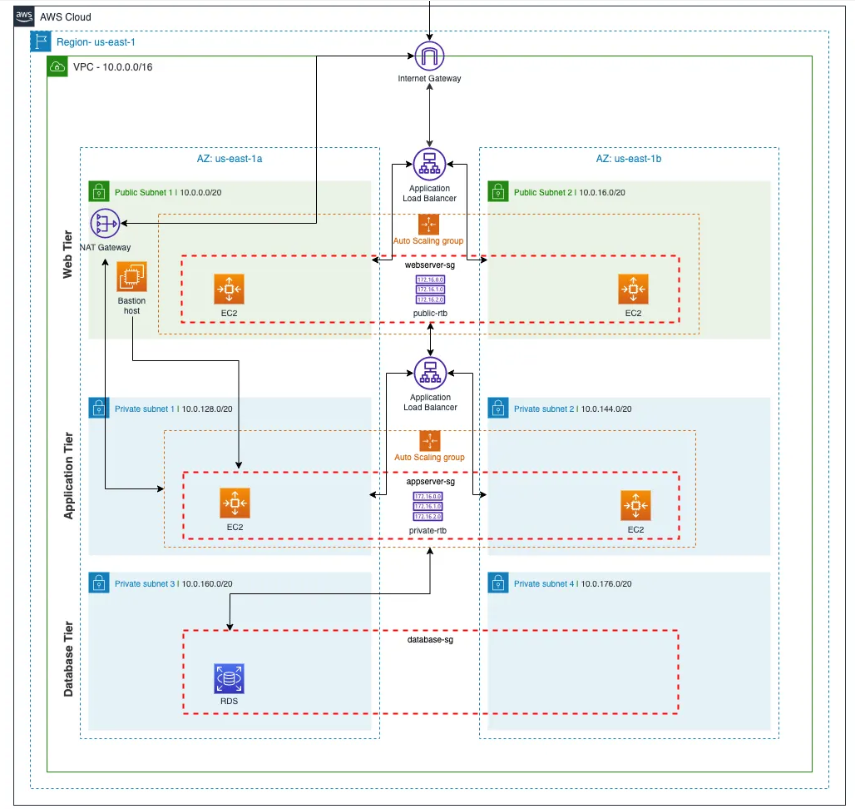

# AWS 3-Tier Web Application Infrastructure as Code

[](https://www.terraform.io/)
[](https://aws.amazon.com/)

A production-ready Terraform configuration that deploys a highly available, scalable 3-tier web application architecture on AWS. This project implements the architecture described in the [Medium article](https://medium.com/@aaloktrivedi/building-a-3-tier-web-application-architecture-with-aws-1b2c5e35b5a3) by Aalok Trivedi, but fully automated with Infrastructure as Code.

## 🏗️ Architecture Overview

This implementation creates a secure, highly available 3-tier architecture across multiple Availability Zones:



### Key Components

- **Web Tier**: Auto-scaling EC2 instances behind an Application Load Balancer
- **Application Tier**: Backend servers in private subnets with internal load balancing
- **Database Tier**: MySQL RDS instance with Multi-AZ deployment
- **Networking**: VPC with public/private subnets across multiple AZs
- **Security**: Security groups with least-privilege access
- **State Management**: S3 backend with DynamoDB locking for team collaboration

## ✨ Features

- 🚀 **Highly Available**: Multi-AZ deployment with auto-scaling
- 🔒 **Secure**: Private subnets, security groups, and encrypted state
- 📈 **Scalable**: Auto-scaling groups with CPU-based scaling policies
- 🛡️ **Production-Ready**: State locking, versioning, and backup retention
- 🤝 **Team-Friendly**: Remote state management for collaboration
- 📚 **Well-Documented**: Comprehensive README and inline comments
- 🧪 **Tested**: Validated Terraform configurations

## 📋 Prerequisites

Before deploying, ensure you have:

- **AWS Account** with appropriate permissions
- **AWS CLI** configured (`aws configure`)
- **Terraform** v1.0 or later
- **Git** for cloning the repository
- **SSH Key Pair** for EC2 access (created in AWS console)

### Required AWS Permissions

Your AWS user/role needs these permissions:
- EC2 full access
- VPC full access
- RDS full access
- S3 full access
- DynamoDB full access
- IAM full access (for key pairs)
- Auto Scaling full access
- ELB full access

## 🚀 Quick Start

For the impatient, here's the fast track:

```bash
# Clone and deploy
git clone https://github.com/ikramulhaq63/aws-iac-three-tier-stack.git
cd aws-iac-three-tier-stack
./deploy.sh

# Access your application
# Get the ALB DNS from Terraform outputs
terraform output web_alb_dns
```

## 📖 Detailed Deployment Guide

### Step 1: Clone the Repository

```bash
git clone https://github.com/ikramulhaq63/aws-iac-three-tier-stack.git
cd aws-iac-three-tier-stack
```

### Step 2: Configure Your Environment

Edit `environments/dev/terraform.tfvars` to customize:

```hcl
# Example customizations
project_name = "my-awesome-app"
vpc_cidr = "10.0.0.0/16"
web_instance_type = "t3.small"
db_instance_class = "db.t3.small"
```

### Step 3: Deploy Bootstrap Resources

First, create the S3 bucket and DynamoDB table for state management:

```bash
cd environments/dev/bootstrap
terraform init
terraform apply
cd ../..
```

### Step 4: Deploy Infrastructure

Now deploy the full 3-tier stack:

```bash
cd environments/dev
terraform init  # Migrates to S3 backend
terraform plan  # Review changes
terraform apply # Deploy everything
```

### Step 5: Access Your Application

After deployment, get the web tier load balancer DNS:

```bash
terraform output web_alb_dns
```

Visit the DNS name in your browser to see the Apache welcome page!

## 🛠️ Available Scripts

This project includes helper scripts for easier management:

### `deploy.sh`
Automated deployment script that handles the entire process:

```bash
./deploy.sh
```

### `destroy.sh`
Safe destruction script that preserves state storage:

```bash
./destroy.sh
```

### Manual Commands

If you prefer manual control:

```bash
# Bootstrap (run once)
cd environments/dev/bootstrap && terraform init && terraform apply && cd ../..

# Deploy infrastructure
cd environments/dev && terraform init && terraform apply

# Destroy infrastructure (keeps state)
cd environments/dev && terraform destroy

# Destroy everything including state (use with caution!)
cd environments/dev/bootstrap && terraform destroy
```

## 📊 Architecture Details

### Networking
- **VPC**: 10.0.0.0/16 CIDR
- **Public Subnets**: 2 subnets for web tier load balancers
- **Private App Subnets**: 2 subnets for application servers
- **Private DB Subnets**: 2 subnets for RDS instances
- **NAT Gateway**: For private subnet internet access
- **Internet Gateway**: For public subnet internet access

### Security Groups
- **Web Tier**: Allows HTTP/HTTPS from anywhere, SSH from your IP
- **App Tier**: Allows HTTP from web tier, SSH from bastion host
- **Database**: Allows MySQL from app tier only
- **Bastion**: Allows SSH from your IP only

### Auto Scaling
- **Web Tier**: 2-3 instances, scales on CPU > 50%
- **App Tier**: 1-3 instances, scales on CPU > 50%

### Database
- **Engine**: MySQL 8.0
- **Instance Class**: db.t3.micro (configurable)
- **Storage**: 20GB with 100GB max auto-scaling
- **Backup**: 7-day retention
- **Multi-AZ**: Disabled (enable for production)

## 🔧 Customization

### Environment Variables

Create multiple environments by copying the `dev` folder:

```bash
cp -r environments/dev environments/prod
# Edit terraform.tfvars in prod for different settings
```

### Scaling Configuration

Adjust scaling in `terraform.tfvars`:

```hcl
# Web tier scaling
web_min_size = 2
web_max_size = 10
web_desired_capacity = 3

# App tier scaling
app_min_size = 1
app_max_size = 5
app_desired_capacity = 2
```

### Database Configuration

Customize database settings:

```hcl
db_engine = "mysql"
db_engine_version = "8.0"
db_instance_class = "db.t3.small"
db_allocated_storage = 20
```

## 🧪 Testing

After deployment, verify:

1. **Web Access**: Visit ALB DNS - should show Apache page
2. **SSH Access**: Connect via bastion host to app servers
3. **Database**: Connect from app server using MySQL client
4. **Scaling**: Monitor CPU and verify auto-scaling works
5. **High Availability**: Test failover (terminate instances)

## 🔐 SSH Access & Key Management

### Generated SSH Key Pair

During deployment, Terraform automatically generates an SSH key pair for secure access to your EC2 instances:

- **Private Key Location**: `modules/security/My-3tier-webapp-key.pem`
- **Key Pair Name**: `My-3tier-webapp-key-pair` (created in AWS)
- **Permissions**: Automatically set to `0400` (read-only for owner)

### Connecting to Instances

#### 1. Bastion Host (Jump Server)
```bash
# SSH to bastion host
ssh -i modules/security/My-3tier-webapp-key.pem ec2-user@<BASTION_PUBLIC_IP>

# The bastion public IP is shown in deployment outputs
```

#### 2. Application Servers (via Bastion)
```bash
# From bastion host, SSH to app servers
ssh -i My-3tier-webapp-key.pem ec2-user@<PRIVATE_APP_SERVER_IP>
```

#### 3. Web Servers (via Bastion)
```bash
# From bastion host, SSH to web servers
ssh -i My-3tier-webapp-key.pem ec2-user@<PRIVATE_WEB_SERVER_IP>
```

### Key Security Notes

- ⚠️ **Keep the private key secure** - Never commit it to version control
- 🔒 **File permissions** are automatically set to prevent unauthorized access
- 🗑️ **Key is deleted** when you destroy the infrastructure
- 🔄 **New key generated** on each deployment for security

### Finding Instance IPs

Use AWS Console or CLI to find private IPs:
```bash
# List EC2 instances
aws ec2 describe-instances --filters "Name=tag:Name,Values=My-3tier-webapp*" --query 'Reservations[*].Instances[*].[Tags[?Key==`Name`].Value|[0],PrivateIpAddress,PublicIpAddress]' --output table
```

## 🛡️ Security Considerations

- All sensitive data is parameterized (no hardcoded secrets)
- Database credentials stored in AWS Secrets Manager
- Private subnets protect backend services
- Security groups follow least-privilege principle
- SSH access restricted to bastion host
- State files encrypted in S3